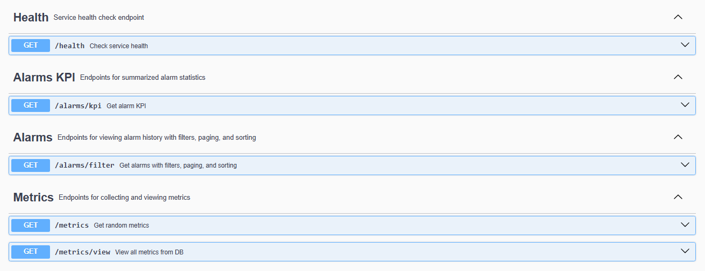

# Monitoring Service (MVP)

[]()
[]()
[]()
[]()
[](https://www.h2database.com/html/main.html)

Monitoring Service is a professional-grade microservice monitoring system built with Spring Boot.
It collects CPU, memory, and request metrics from services, triggers alerts, stores metrics and alarm history, and provides advanced APIs for monitoring and reporting.

## Features
## Features

- **Metrics Collection & Storage**
   - Internal `/metrics` endpoint generating random sample metrics.
   - Scheduled metrics collection every 5 seconds using `MetricsCollector`.
   - Stores metrics in H2 in-memory database.
   - `/metrics/view` endpoint to retrieve all collected metrics.

- **Health Check**
   - Simple `/health` endpoint to verify service status.

- **Advanced Alarm System**
   - Threshold-based alarms for CPU, Memory, and Requests.
   - Severity levels: `WARNING` and `CRITICAL`.
   - Cooldown mechanism to prevent alarm spamming.
   - Notifiers architecture: supports multiple channels (console, email, SMS, etc.).
   - Alarms are stored in the database for history and auditing (`AlarmEntity` + `AlarmRepository`).

- **Alarm Management & Reporting**
   - `/alarms` endpoint to retrieve all alarms.
   - `/alarms/filter` endpoint for filtering by severity and time range.
   - `/alarms/advanced` endpoint with **paging, sorting, and filters**.
   - Summarized KPI statistics via `/alarms/kpi` endpoint:
      - Total alarms
      - Count per severity (`WARNING`, `CRITICAL`)
      - Easily extendable to include daily/weekly trends and charts.

- **Extensible & Maintainable**
   - Fully documented with JavaDoc.
   - Easy to add new Notifiers or additional metrics.
   - Modular design for future enhancements (trend analysis, dashboards, external alert integrations).

---

## Architecture Overview

Monitoring Service follows a **modular microservice-oriented architecture**:

1. **Controllers** – Handle API requests:
   - `MetricsController` → `/metrics` and `/metrics/view`
   - `HealthController` → `/health`
   - `AlarmController` → `/alarms` and filtered/paged alarm retrieval
   - `AlarmKpiController` → `/alarms/kpi` for summarized statistics

2. **Services** – Core logic and scheduling:
   - `MetricsCollector` → Periodically collects metrics
   - `MetricService` → Provides access to metric DTOs
   - `AlarmService` → Evaluates metrics against thresholds, triggers alarms, saves to database
   - `AlarmKpiService` → Generates alarm statistics/KPI

3. **Repositories** – Database access (JPA/H2):
   - `MetricRepository` → Stores metric entities
   - `AlarmRepository` → Stores alarm entities

4. **Model/Entities**:
   - `Metric` → CPU, Memory, Requests, Timestamp
   - `Alarm` → Runtime alarm object
   - `AlarmEntity` → Persisted alarm record

5. **Notifiers**:
   - Interface-based system to plug in multiple notification channels.
   - Example: `ConsoleNotifier` (logs to console), future: email/SMS/Slack integrations.

6. **Configuration**
   - `MonitoringConfig` → Metrics collection configuration
   - `AlarmConfig` → Alarm thresholds and cooldown
   - `SchedulerConfig` → Enables Spring's `@Scheduled` tasks
   - `SwaggerConfig` → OpenAPI documentation

---

## Endpoints

| Endpoint                        | Method | Description                                                               |
|---------------------------------|--------|---------------------------------------------------------------------------|
| /health                         | GET    | Returns service health status.                                            |
| /metrics                        | GET    | Returns random sample metrics.                                            |
| /metrics/view                   | GET    | Returns all collected metrics from the database.                          |
| /alarms                         | GET    | Retrieves all alarms stored in the database.                              |
| /alarms/filter                  | GET    | Retrieve alarms with optional severity/time , paging, and sortingfilters. |
| /alarms/kpi                     | GET    | Returns summarized alarm statistics (total, severity counts).             |

---

**Example /metrics response:**
```json
{
"cpu": 72,
"memory": 45,
"requests": 523
}
```

**Example /alarms response:**
```json
{
  "totalAlarms": 25,
  "severityCounts": {
    "CRITICAL": 10,
    "WARNING": 15
  }
}
```
---
## 📈 Prometheus Integration

This project integrates **Prometheus** using **Micrometer** to expose runtime metrics for monitoring and alerting.

### 🔧 Configuration

Prometheus metrics are exposed at:

```
http://localhost:8080/actuator/prometheus
```

---
## Getting Started

### Prerequisites

- Java 17 or higher
- Maven
- (Optional) IDE: IntelliJ IDEA, VS Code, etc.

H2 in-memory database is used – no external database required.

### Build and Run

Clone the repository:
   git clone https://github.com/shkBostan/monitoring-service.git


## 📖 API Documentation

This project includes interactive API documentation powered by **Swagger / OpenAPI**.  
You can explore all available endpoints and test them directly from the Swagger UI.

Access it locally at: `http://localhost:8080/swagger-ui.html`

### Swagger UI Preview


## Author

s Bostan

## Created

Aug, 2025

---

## License  
This project is licensed under the Apache License 2.0 – see the [LICENSE](LICENSE.txt) file for details.