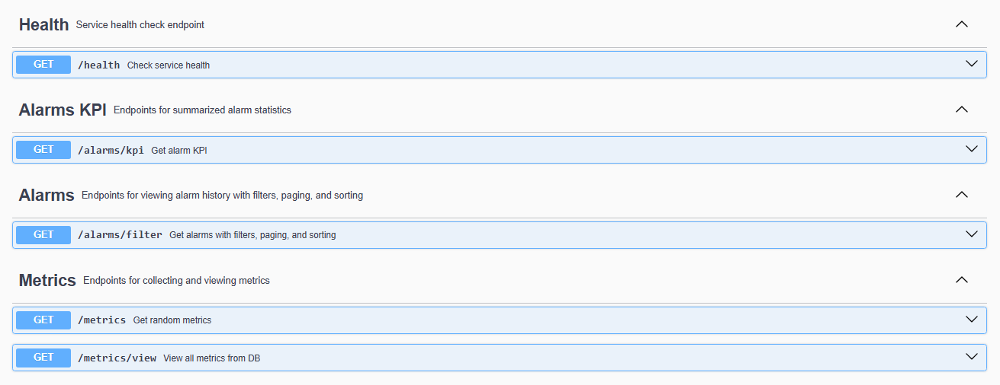

# Monitoring Service (MVP)

[]()
[]()
[]()
[]()
[](https://www.h2database.com/html/main.html)

Monitoring Service is a lightweight microservice monitoring system built with Spring Boot.
It collects CPU, memory, and request metrics from services and stores them in an in-memory H2 database.
This MVP is intended for learning, testing, and demonstration purposes.

## Features

- Internal /metrics endpoint generating random sample metrics.
- Scheduled metrics collection every 5 seconds using MetricsCollector.
- Stores metrics in H2 in-memory database (no external database required).
- Simple /health endpoint to verify service status.
- Fully documented with JavaDoc for maintainability.

## Architecture & Structure
```
monitoring-service/
│
├── src/main/java/com/monitoring/monitoring_service/
│   ├── MonitoringServiceApplication.java      // Main Spring Boot application
│   ├── config/
│   │    └── SchedulerConfig.java             // Enables @Scheduled tasks
│   ├── controller/
│   │    ├── HealthController.java            // /health endpoint
│   │    └── MetricsController.java           // /metrics endpoint
│   ├── model/
│   │    └── Metric.java                       // JPA entity for metrics
│   ├── repository/
│   │    └── MetricRepository.java
│   └── service/
│        └── MetricsCollector.java           // Scheduled metric collector
│
├── src/main/resources/
│   └── application.properties
│  
```
## Endpoints

| Endpoint        | Method | Description                                                                 |
|-----------------|--------|-----------------------------------------------------------------------------|
| /health         | GET    | Returns "Monitoring Service is running!" to check service health.           |
| /metrics        | GET    | Returns a sample JSON object with random metrics (cpu, memory, requests) for internal testing. |
| /metrics/view   | GET    | Returns all collected metrics from the database in JSON format.             |

**Example /metrics response:**

{
"cpu": 72,
"memory": 45,
"requests": 523
}

## Getting Started

### Prerequisites

- Java 17 or higher
- Maven
- (Optional) IDE: IntelliJ IDEA, VS Code, etc.

No external database or Docker is required for MVP – H2 in-memory database is used.

### Build and Run

Clone the repository:
   git clone https://github.com/shkBostan/monitoring-service.git


## 📖 API Documentation

This project includes interactive API documentation powered by **Swagger / OpenAPI**.  
You can explore all available endpoints and test them directly from the Swagger UI.

Access it locally at: `http://localhost:8080/swagger-ui.html`

### Swagger UI Preview


## Author

s Bostan

## Created

Aug, 2025


## License

MIT License © 2025 S. Bostan  
Free to use, modify, and distribute, **as long as the original author’s name is preserved**. No warranty is provided.
